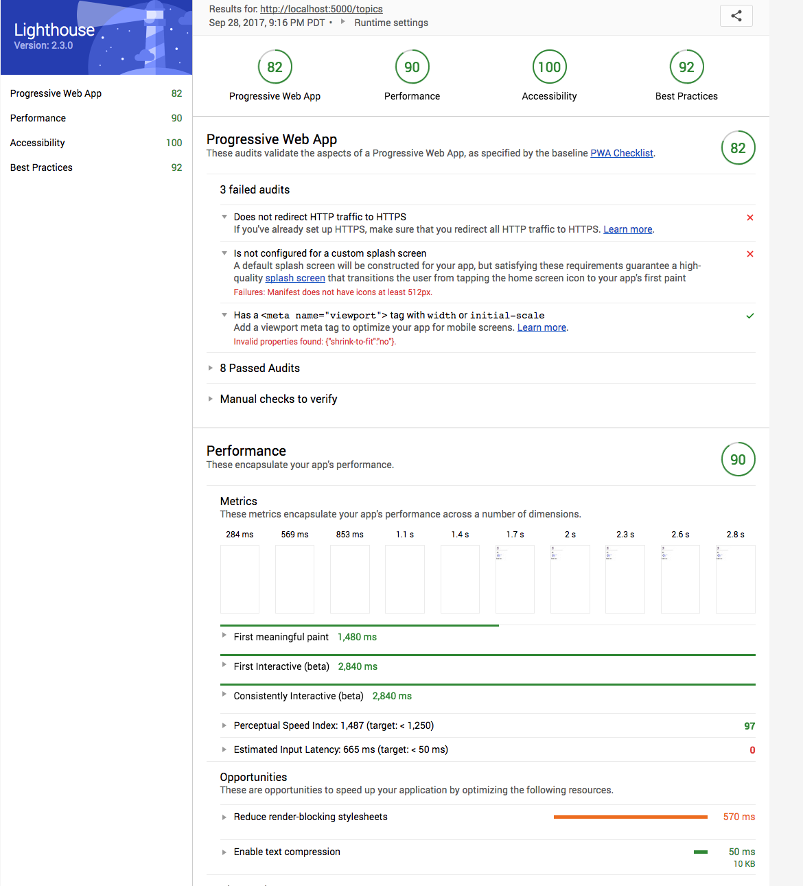
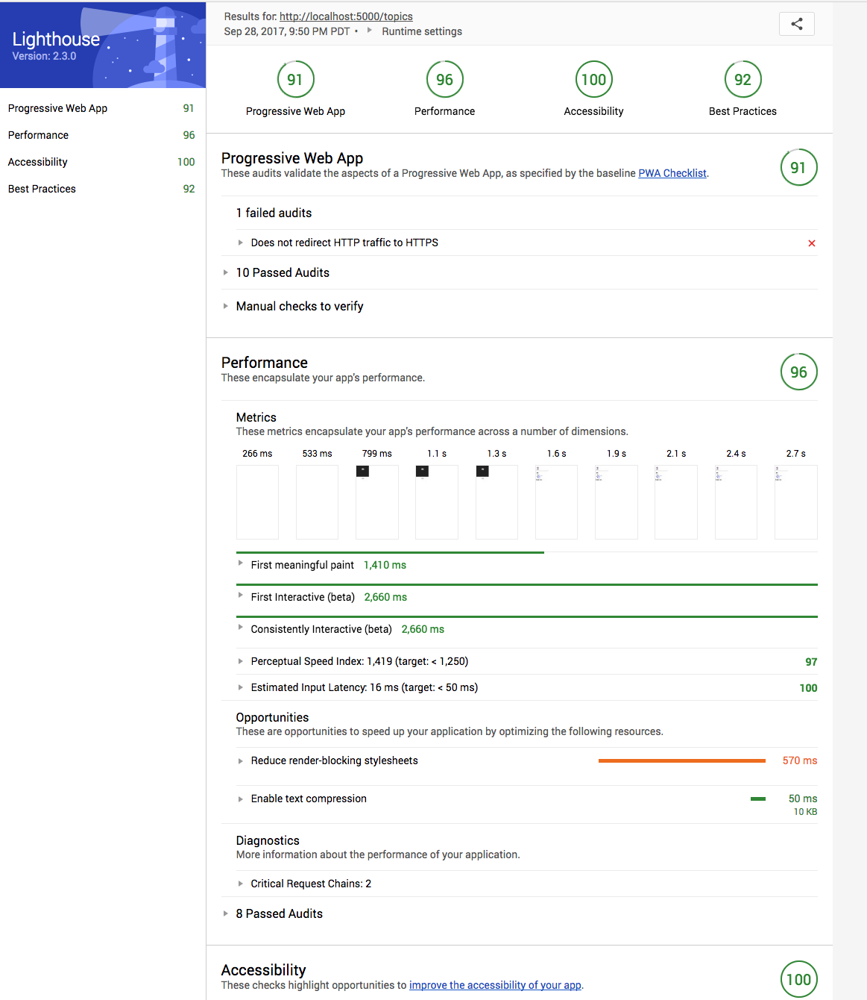

# PWA Demo
[Commit](https://github.com/vidaaudrey/fedulab/commit/470c5dc455b9c5cef273daf973fa01e6f03ea66f)

Create React App comes with default suport for Progress Web Apps (PWA). Before we start to work on this, it's important to read through the [PWA introduction](https://github.com/facebookincubator/create-react-app/blob/master/packages/react-scripts/template/README.md#making-a-progressive-web-app) at Create React App to get some general understanding. 

Addy Osmani has written a series of [articles](https://medium.com/@addyosmani/progressive-web-apps-with-react-js-part-i-introduction-50679aef2b12) about PWA, highly recommend that you read if if you have time. 

You can also follow this simple step-by-step [guide](https://engineering.musefind.com/build-your-first-progressive-web-app-with-react-8e1449c575cd) to add PWA support to the app. (Note there are a few minor changes in manifest.json, index.html and how to register service worker.)

 This is the result before any PWA work:
 

The result after some basic setup on CSS, html meta and manifest.json
 
